# Ephialtès - Unity 2.5D Project

## Table of Contents
- [Ephialtès - Unity 2.5D Project](#ephialt-s---unity-25d-project)
    + [Description](#description)
    + [Player Abilities](#player-abilities)
    + [Controls](#controls)
    + [Enemies](#enemies)
      - [Black Shadow](#black-shadow)
      - [Red Shadow](#red-shadow)
    + [Levels](#levels)
      - [Hospital](#hospital)
      - [Factory](#factory)
      - [Forest](#forest)
      - [Village](#village)
      - [Mansion](#mansion)
    + [Light Activated Objects](#light-activated-objects)
      - [Blocks](#blocks)
      - [Platforms](#platforms)
      - [Invisible Traps](#invisible-traps)
    + [Bugs & Incomplete Features](#bugs---incomplete-features)
      - [Pushable Blocks](#pushable-blocks)
      - [Disappearing Line Renderer](#disappearing-line-renderer)
      - [Block activatable through an obstacle](#block-activatable-through-an-obstacle)
    + [End](#end)

### Description
Ephialtès is a puzzle/platform game that takes place in a dark and disturbing world. The light will by your best ally as you solve puzzles, activate plateforms and defend yourself against the shadows.

### Player Abilities
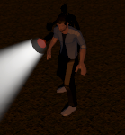

- Basic Movement
- Running
- Jump
- Interact

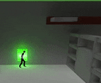
- Flashlight Aiming

### Controls
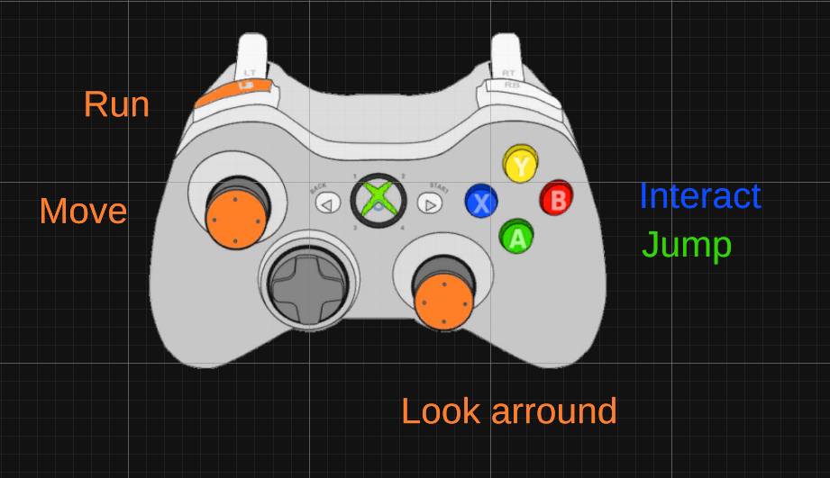

### Enemies

#### Black Shadow
- Stunned when illuminated by light

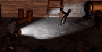

#### Red Shadow
- Becomes aggressive when illuminated by light

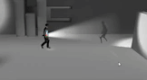

### Levels
#### Hospital
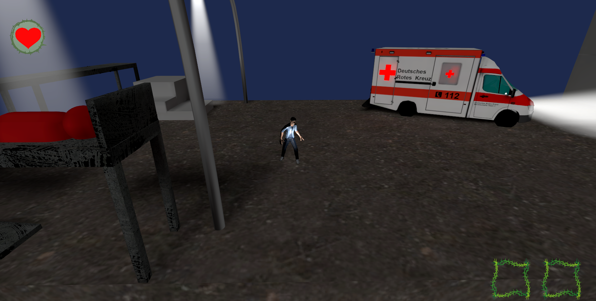
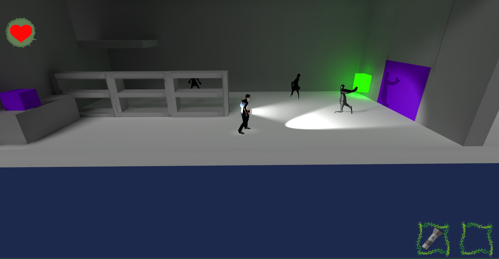

#### Factory
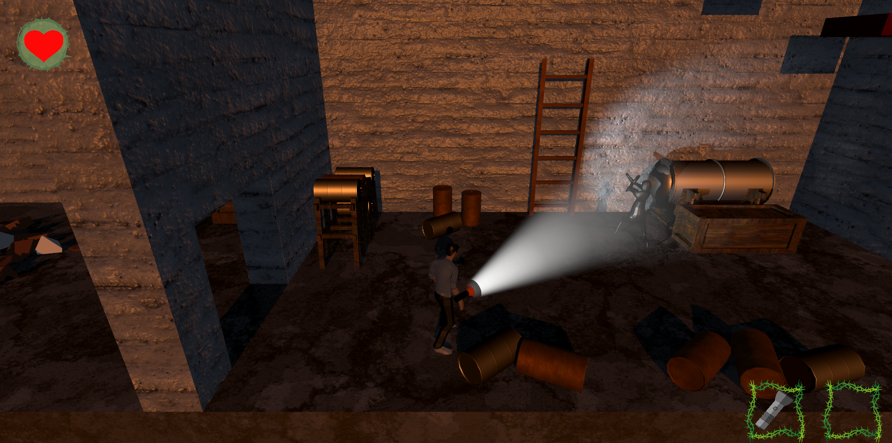
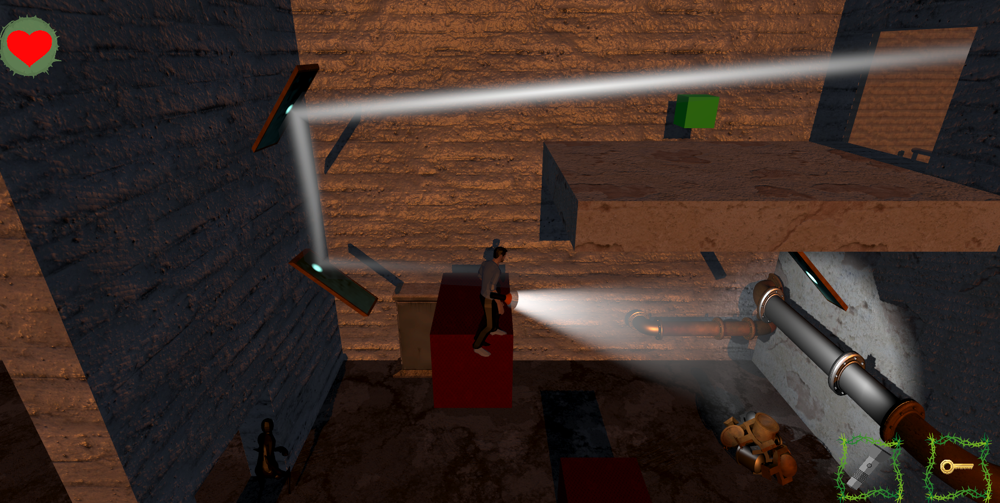

#### Forest
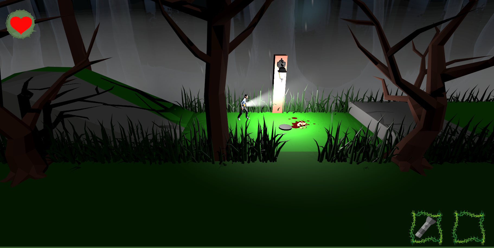

#### Village
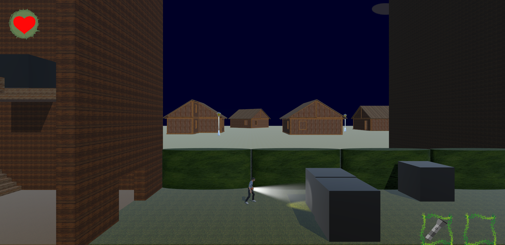
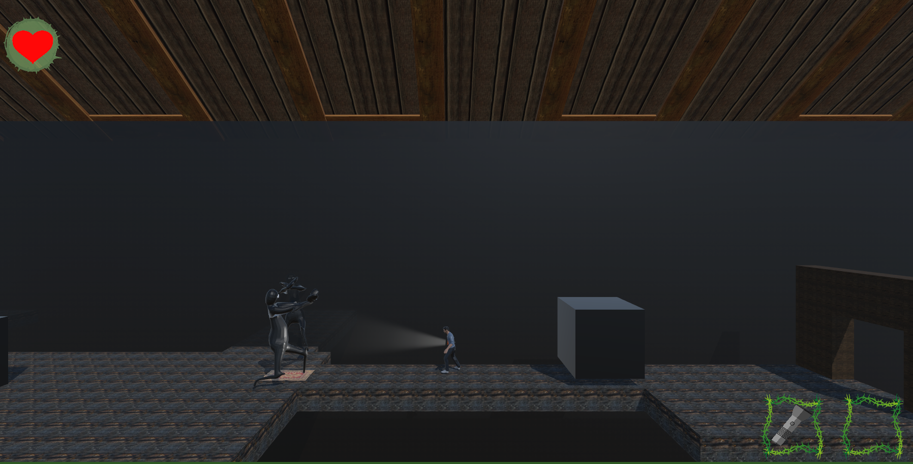

#### Mansion
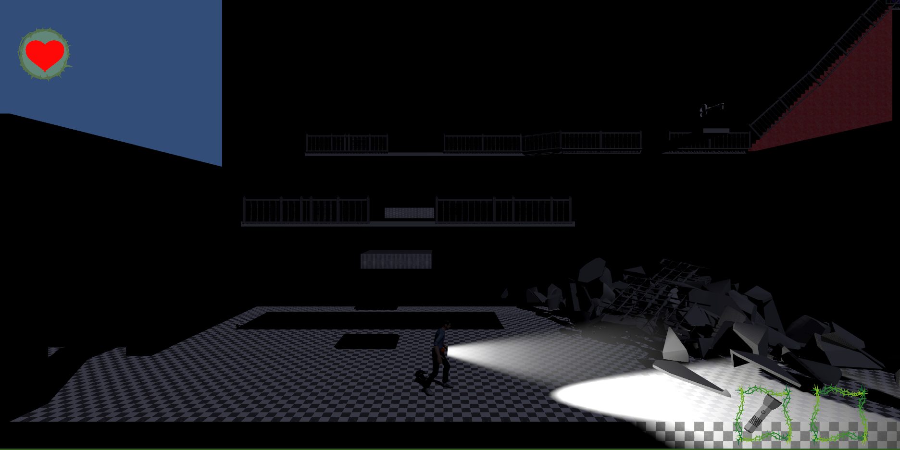

### Light Activated Objects
#### Blocks
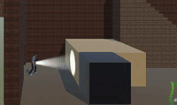

#### Platforms
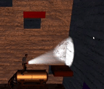

#### Invisible Traps
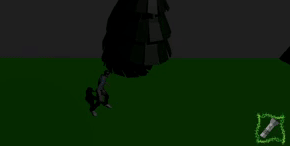

### Bugs & Incomplete Features
#### Pushable Blocks
Under certain conditions, the player can move the black blocks in the game through walls.

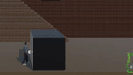

#### Disappearing Line Renderer
The line renderer disappears when the end is not hitting an object in the scene

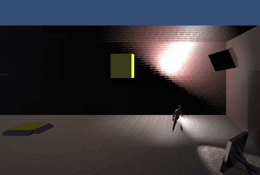

Notice that this does not happen in the gif below. This is due to the invisible walls in the front of the scene.
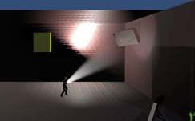

#### Block activatable through an obstacle
Usually solid obstacles will stop light from reaching light activateable objects. However, in this particular case, we can see that the block is still moving. This is because once the block is touched by the light collider(a trigger), it checks to see if a gameobject with the name "Cube"(the name of a child object) is hit by the raycast from the flashlight. Here the obstacle on which the block sits is also called "Cube".

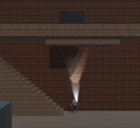

### End